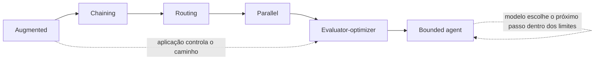

# Controlled Autonomy Lab

> **Idioma:** [English](README.md) · **Português (Brasil)**

[](https://github.com/brunovicco/controlled-autonomy-lab/actions/workflows/quality.yml)


> Mesmos padrões de controle. Diferentes posturas de evidência. Múltiplos providers.

Controlled Autonomy Lab é uma pequena implementação de referência em Python para comparar seis arquiteturas de aplicações com LLMs sobre fixtures limitados de incidentes de produção com diferentes posturas de evidência.

A pergunta central não é se agentes são melhores que workflows. É:

> **Quem controla o próximo passo: código determinístico da aplicação ou o modelo?**

O lab torna esse limite de delegação observável por meio de topologia de execução, uso de ferramentas, latência, uso de tokens, grounding determinístico, avaliação em nível de claim, verificações de autoridade causal e julgamento semântico seletivo.

## Origem e motivação

A ideia deste laboratório surgiu enquanto eu estudava o **Módulo 1 — Claude Platform & Solution Design** da trilha **Claude Certified Architect Foundations**.

O conteúdo sobre seleção de padrões apresenta augmented LLMs, workflows e agents como escolhas arquiteturais diferentes sobre **previsibilidade e autonomia do modelo**. Em um workflow, o código da aplicação mantém o controle do caminho geral de execução enquanto o modelo exerce julgamento limitado dentro de cada etapa. Em um agent, o próprio modelo pode controlar a trajetória e decidir o próximo passo a partir do que já observou.

Essa distinção levantou uma pergunta prática:

> O que realmente muda quando o controle sobre o próximo passo deixa o código determinístico da aplicação e passa para o modelo?

Controlled Autonomy Lab é minha tentativa independente de tornar esse trade-off arquitetural observável e mensurável, em vez de mantê-lo apenas no campo conceitual.

Por isso, o projeto compara a mesma tarefa limitada usando diferentes padrões de controle e mede topologia de execução, comportamento de providers, grounding, autoridade causal, latência, uso de tokens e uso limitado de ferramentas.

O treinamento também reforçou duas decisões de design que permanecem explícitas neste repositório:

- preferir a arquitetura mais simples que satisfaça os requisitos de tolerância a erro e observabilidade da tarefa, em vez de escolher agents apenas pela flexibilidade;
- tratar autonomia do modelo e permissões de ferramentas como uma fronteira de autoridade, mantendo capacidades executáveis tão restritas quanto a tarefa permitir.

Essa também é a razão pela qual o projeto **não** introduz orquestração multi-agent, MCP ou A2A apenas para ampliar a quantidade de tecnologias utilizadas. Esses mecanismos devem entrar quando existir uma necessidade real de decomposição ou uma fronteira autêntica entre processos ou serviços.

> **Nota de independência:** Controlled Autonomy Lab é um projeto independente de engenharia e aprendizado. Não é um projeto da Anthropic, uma arquitetura de referência oficial, um artefato da certificação ou um endosso da Anthropic. A implementação, os experimentos, os avaliadores, a metodologia e as conclusões deste repositório são de minha autoria.

## O case em resumo

| Dimensão | Escopo |
| --- | --- |
| Padrões de controle | 6 — augmented, chaining, routing, parallel, evaluator-optimizer, bounded agent |
| Bundles de provider | OpenAI, Anthropic, Groq |
| Registro experimental congelado | 90 execuções repetidas + 72 tentativas breadth + 72 tentativas epistêmicas |
| Camadas de avaliação | Grounding v1, Epistemic v4.1, Claim Evaluation v2, semantic escalation seletivo |
| Autoridade do agente | 5 ferramentas read-only, máximo de 6 passos, máximo de 8 tool calls, sem alteração de produção |
| Reprodutibilidade | commits congelados, evidence packs metadata-only, checksums SHA-256, sem retries ocultos |

Nas três gerações congeladas e separadas, o repositório registra **234 execuções/células tentadas**. Elas são mantidas intencionalmente como gerações distintas e **não** são agrupadas como uma única amostra estatística.



Três achados motivam o case:

- **grounding não é a mesma coisa que disciplina causal**;
- **comportamento do provider/modelo pode se tornar comportamento do control plane** quando o modelo escolhe o próximo passo;
- **autonomia limitada não é autoridade irrestrita** — o agente pode adquirir evidência dinamicamente enquanto código determinístico mantém limites rígidos de execução.

## O que este case demonstra

A mesma tarefa de análise de incidente pode ser implementada com seis padrões de controle diferentes:

1. Augmented LLM
2. Prompt chaining
3. Routing
4. Parallelization
5. Evaluator-optimizer
6. Bounded tool-using agent

O projeto avalia o comportamento resultante por camadas progressivamente mais fortes — mas deliberadamente separadas:

```text
pattern execution
      ↓
Grounding Evaluation v1
specifics exatos, associações, disciplina causal
      ↓
Epistemic Evaluation v4.1
postura da evidência e alinhamento de autoridade causal
      ↓
Claim Evaluation v2
fato vs inferência vs ação vs claim não suportada
      ↓
selective semantic escalation v2.1
somente perdas determinísticas conservadoras
      ↓
independent semantic judge v2.2
desacoplamento opcional gerador × judge
```

A regra de autoridade é intencionalmente assimétrica:

```text
Grounding v1 hard failure
        ↓
semantic evaluation skipped
        ↓
UNSUPPORTED_CLAIM remains authoritative
```

Um LLM judge pode melhorar cobertura para uma paráfrase conservadoramente rejeitada, mas não pode justificar uma versão, medição, associação não suportada ou um causal overclaim genuíno.

## Evidência até aqui

### Benchmark repetido de arquitetura congelado

O benchmark repetido mantém `INC-001` constante e mede comportamento repetido nos seis padrões de arquitetura e três bundles provider/modelo/configuração.

```text
1 incident × 6 patterns × 5 runs × 3 provider bundles = 90 executions
```

Todas as **90/90 execuções concluíram com sucesso**.

Specific grounding por padrão:

| Padrão | OpenAI | Groq | Anthropic |
| --- | ---: | ---: | ---: |
| Augmented | 100.0% | 88.3% | 95.3% |
| Chaining | 90.0% | 67.4% | 82.1% |
| Routing | 100.0% | 87.8% | 84.6% |
| Parallel | 92.8% | 87.1% | 94.8% |
| Evaluator-optimizer | 100.0% | 88.5% | 96.7% |
| Agent | 100.0% | 82.6% | 93.6% |

As observações mais fortes do benchmark repetido são:

- chaining teve o menor ratio de specific grounding nos três bundles de provider;
- evaluator-optimizer permaneceu competitivo em grounding;
- chamadas adicionais de modelo não melhoraram grounding de forma monotônica;
- a topologia de execução do agente dependeu do bundle provider/modelo;
- agentes OpenAI e Anthropic mostraram uma trajetória grossa, enquanto Groq produziu quatro;
- specific grounding alto não garantiu disciplina causal.

Esses são resultados de **bundles provider/modelo/API/configuração**, e não um leaderboard puro de modelos.

Veja [`docs/pt-BR/FROZEN_THREE_PROVIDER_BENCHMARK.md`](docs/pt-BR/FROZEN_THREE_PROVIDER_BENCHMARK.md) para a análise completa congelada das 90 execuções.

### Breadth benchmark multi-incidente

O experimento breadth muda a postura da evidência mantendo fixos os seis padrões de arquitetura:

```text
4 incidents × 6 patterns × 1 run × 3 provider bundles = 72 attempted cells
```

Geração principal:

- **72 células tentadas**;
- **59 células bem-sucedidas**;
- **12 células Groq com rate limit**;
- **1 célula Anthropic com provider error**;
- métricas de qualidade calculadas somente sobre células `status=ok`;
- falhas do provider preservadas como evidência de disponibilidade, e não como zeros de qualidade imputados.

Resultados observados no nível de arquitetura:

| Padrão | Observado | Grounding médio | Causal overclaims |
| --- | ---: | ---: | ---: |
| Augmented | 10/12 | 97.8% | 3 |
| Chaining | 9/12 | 74.4% | 5 |
| Routing | 10/12 | 92.8% | 2 |
| Parallel | 10/12 | 94.9% | 7 |
| Evaluator-optimizer | 10/12 | 97.6% | 4 |
| Agent | 10/12 | 95.4% | **0** |

As observações mais importantes do breadth benchmark são:

- o bounded tool-using agent foi o único padrão com zero causal overclaims detectados em todas as células observáveis;
- chaining mostrou o trade-off geral mais fraco de grounding/custo;
- parallelization manteve grounding alto, mas produziu mais causal overclaims e o maior footprint de tokens;
- evaluator-optimizer às vezes revisou seu output, mas um quality pass interno não garantiu correção causal externa;
- routing expôs seleção de control flow dependente de provider/modelo;
- specific grounding e autoridade causal permaneceram dimensões separadas de avaliação;
- a detecção lexical de linguagem de incerteza saturou em todas as células bem-sucedidas e, portanto, não é tratada como prova de correção epistêmica.

O resultado **não** é “agentes vencem”. Ele sustenta a hipótese mais restrita de que autonomia limitada pode ajudar um sistema a adquirir evidência dinamicamente enquanto opera dentro de limites explícitos de ferramentas, ações e execução.

Veja:

- [`docs/pt-BR/MULTI_INCIDENT_BREADTH_BENCHMARK.md`](docs/pt-BR/MULTI_INCIDENT_BREADTH_BENCHMARK.md) para o desenho experimental e limites congelados de execução;
- [`docs/pt-BR/MULTI_INCIDENT_BREADTH_RESULTS.md`](docs/pt-BR/MULTI_INCIDENT_BREADTH_RESULTS.md) para a análise completa congelada, ameaças à validade e não-afirmações explícitas;
- [`results/breadth-main/`](results/breadth-main/) para o evidence pack metadata-only curado e checksums SHA-256.

### Benchmark de postura epistêmica

Uma nova geração congelada avalia se a autoridade causal da resposta final corresponde à postura da evidência:

```text
4 incidents × 6 patterns × 1 run × 3 provider bundles = 72 attempted cells
```

A geração produziu **70 células bem-sucedidas**, com uma célula Groq rate-limited e uma célula Groq provider-error preservadas como evidência de disponibilidade.

Os veredictos Epistemic v4.1 nas células bem-sucedidas foram:

| Veredicto | Contagem | Participação |
| --- | ---: | ---: |
| Aligned | 20 | 28.6% |
| Overclaimed | 41 | 58.6% |
| No-position | 6 | 8.6% |
| Over-hedged | 3 | 4.3% |

`INC-001` e `INC-004`, os dois fixtures que exigem maior contenção causal, responderam por **29/41 overclaims detectados (~70.7%)**. Entre os padrões totalmente observados, o bounded tool-using agent apresentou a menor taxa de overclaim detectado nesta geração, com **4/12 (33.3%)**.

Esses são **veredictos determinísticos detectados sob Epistemic v4.1**, não prova de erro causal semântico. O resultado não estabelece que agentes sejam universalmente mais seguros ou melhores.

Veja:

- [`docs/pt-BR/EPISTEMIC_EVALUATION.md`](docs/pt-BR/EPISTEMIC_EVALUATION.md) para a semântica e limitações do evaluator;
- [`docs/pt-BR/EPISTEMIC_GENERATION_V2_RESULTS.md`](docs/pt-BR/EPISTEMIC_GENERATION_V2_RESULTS.md) para a análise congelada e não-afirmações;
- [`results/epistemic-v4-1-main/`](results/epistemic-v4-1-main/) para o evidence pack metadata-only e checksums SHA-256.

### Calibração em nível de claim

Grounding v1 verifica deliberadamente um conjunto restrito de sinais determinísticos. Claim Evaluation v2 adiciona uma segunda visão:

| Tipo de claim | Significado |
| --- | --- |
| `SUPPORTED_FACT` | a evidência limitada suporta uma claim declarativa |
| `SUPPORTED_INFERENCE` | uma inferência qualificada está ancorada em evidência |
| `PROPOSED_ACTION` | uma recomendação ou mitigação, e não um fato observado |
| `UNSUPPORTED_CLAIM` | falta suporte ou existe uma falha rígida de grounding |

Um fixture estático de uma execução observada mantém essa camada testável por regressão sem consumir quota de provider.

Veja [`docs/pt-BR/CLAIM_EVALUATION.md`](docs/pt-BR/CLAIM_EVALUATION.md).

### Semantic escalation seletivo

O evaluator determinístico deixa intencionalmente algumas paráfrases fiéis como não suportadas em vez de fingir realizar NLI.

Semantic Claim Evaluation v2.1, portanto, avalia apenas perdas conservadoras elegíveis. A calibração live reduziu o trabalho semântico depois que fatos do incidente atual voltaram a ser resolvidos por matching determinístico de alta confiança.

A paráfrase restante de contexto histórico exigiu entailment semântico e foi promovida sem enfraquecer a regra de hard failure do Grounding v1.

Veja [`docs/pt-BR/SEMANTIC_CLAIM_EVALUATION.md`](docs/pt-BR/SEMANTIC_CLAIM_EVALUATION.md).

### Desacoplamento gerador × judge

Semantic Judge Decoupling v2.2 separa geração da resposta e julgamento semântico.

Dois smokes do bounded agent usaram um gerador OpenAI e um judge Groq com `self_judge=false`. Eles validam a **arquitetura de routing e autoridade**, não a acurácia do judge nem ground truth.

Veja [`docs/pt-BR/SEMANTIC_JUDGE_DECOUPLING.md`](docs/pt-BR/SEMANTIC_JUDGE_DECOUPLING.md).

## Fixtures de incidentes

`INC-001` continua sendo o incidente baseline usado pelo benchmark repetido de arquitetura.

Ele descreve `checkout-api` com:

- HTTP 5xx subindo de `0.2%` para `8.7%`;
- latência p95 subindo de `310ms` para `2840ms`;
- deployment `v2.18.4` às `13:58` com nova configuração de timeout do payment-provider;
- aumento de latência do payment-provider pouco depois das `14:00`;
- nenhum outage confirmado do provider;
- contexto histórico de incidente que não é evidência da causa raiz atual.

O fixture cria intencionalmente correlação sem provar causalidade atual.

O breadth benchmark multi-incidente adiciona três posturas de evidência contrastantes:

| Incidente | Postura da evidência |
| --- | --- |
| `INC-001` | correlação sem causa atual comprovada |
| `INC-002` | causa por deployment explicitamente confirmada |
| `INC-003` | causa por dependência explicitamente confirmada |
| `INC-004` | evidência inconclusiva que exige abstention |

Os quatro fixtures testam se o comportamento da arquitetura muda quando o sistema pode inferir uma causa, precisa preservar incerteza ou deve se abster.

Um bom output deve distinguir fatos observados, conclusões causais suportadas, hipóteses, contexto histórico e recomendações reversíveis.

## Modelo de controle

| Padrão | Quem controla o caminho? | Model calls | Uso de tools | Principal guarda |
| --- | --- | ---: | ---: | --- |
| Augmented LLM | aplicação | 1 | não | uma chamada limitada |
| Chaining | aplicação | 3 | não | handoffs fixos |
| Routing | aplicação + classifier | 2 | não | allowlist de rotas |
| Parallelization | aplicação | 4 | não | fan-out/fan-in fixos |
| Evaluator-optimizer | aplicação | variável | não | schema + orçamento de revisão |
| Agent | modelo | variável | sim | allowlist de tools + budgets de passos/tool calls |

A distinção é arquitetural: quando código determinístico controla o próximo passo, a topologia de execução é fixa por construção. Quando o modelo controla o próximo passo, o comportamento do provider/modelo também pode mudar a própria trajetória.

## Arquitetura

```text
src/autonomy_lab/
├── domain/                              # contratos neutros em relação ao provider
├── application/
│   ├── benchmark.py                    # orquestração do benchmark
│   ├── grounding.py                    # grounding determinístico
│   ├── claim_evaluation.py             # classificação determinística de claims
│   ├── semantic_claim_evaluation.py    # merge semântico seletivo
│   └── patterns/                       # seis padrões de autonomia
├── adapters/
│   ├── anthropic.py                    # Anthropic Messages nativa
│   ├── openai_responses.py             # OpenAI Responses nativa
│   ├── openai_compatible.py            # Groq/OpenRouter/custom
│   ├── providers.py                    # composição gerador + judge
│   ├── incidents.py                    # fixtures limitados de incidentes
│   └── benchmark_metadata.py
├── cli.py
└── semantic_judge_cli.py
```

O projeto começou a partir de [`claude-python-engineering-harness`](https://github.com/brunovicco/claude-python-engineering-harness), mas o scaffold genérico desnecessário para este case foi removido. O quality runner determinístico e o validador de arquitetura foram preservados porque continuam impondo comportamento útil ao projeto.

Veja [`docs/pt-BR/ARCHITECTURE.md`](docs/pt-BR/ARCHITECTURE.md).

## Suporte a providers

O runtime é neutro em relação ao provider e atualmente inclui três adapters de transporte:

- Anthropic Messages API nativa;
- OpenAI Responses API nativa;
- Chat Completions compatível com OpenAI + function calling para Groq, OpenRouter e endpoints customizados.

| Provider | `LLM_PROVIDER` | Modelo padrão | Caminho de custo |
| --- | --- | --- | --- |
| Anthropic | `anthropic` | `claude-sonnet-5` | API paga |
| OpenAI | `openai` | `gpt-5.6-luna` | API paga |
| Groq | `groq` | `openai/gpt-oss-20b` | Free Plan disponível |
| OpenRouter | `openrouter` | `openrouter/free` | router gratuito |
| Custom compatível com OpenAI | `custom` | definido pelo usuário | depende do provider |

Estado de reasoning específico do provider não entra no modelo de domínio nem nos artefatos de benchmark.

Veja [`docs/pt-BR/PROVIDERS.md`](docs/pt-BR/PROVIDERS.md).

## Início rápido

Requisitos: Python 3.13/3.14 e `uv`.

```bash
uv sync --frozen --all-groups
```

Exemplo gratuito com Groq:

```bash
export LLM_PROVIDER=groq
export GROQ_API_KEY="..."
export GROQ_MODEL=openai/gpt-oss-20b

uv run autonomy-lab run agent --incident INC-001
```

`.env.example` é um arquivo de referência. A aplicação intencionalmente não carrega `.env` automaticamente nem adiciona uma dependência dotenv; exporte variáveis pelo shell ou pelo mecanismo de secrets/configuração de sua preferência.

## Executar e comparar

Um padrão:

```bash
uv run autonomy-lab run augmented --incident INC-001
```

Grounding + claims determinísticas:

```bash
uv run autonomy-lab run agent \
  --incident INC-001 \
  --grounding \
  --claims \
  --json
```

Todos os padrões:

```bash
uv run autonomy-lab compare --incident INC-001
```

Variância de trajetória:

```bash
uv run autonomy-lab repeat agent --incident INC-001 --runs 5
```

Execuções live podem consumir quota do provider ou tokens pagos.

## Benchmarks reproduzíveis

Benchmark repetido:

```bash
uv run autonomy-lab benchmark \
  --incident INC-001 \
  --runs 5 \
  --run-interval-seconds 30 \
  --output results/repeated-<provider>
```

Breadth benchmark multi-incidente:

```bash
uv run autonomy-lab benchmark \
  --all-incidents \
  --runs 1 \
  --run-interval-seconds 30 \
  --output results/breadth-<provider>
```

Cada benchmark rotaciona a ordem dos padrões deterministicamente. Não existem retries ocultos.

Os artefatos contêm metadados de provider/modelo/configuração, métricas de execução, contagens determinísticas de grounding, status de confiabilidade e trajetórias bem-sucedidas. Eles intencionalmente excluem prompts, respostas de modelos, corpos de evidência, argumentos/resultados de ferramentas, texto de claims, texto de julgamento semântico e credenciais.

Veja [`docs/pt-BR/BENCHMARKING.md`](docs/pt-BR/BENCHMARKING.md).

## Grounding Evaluation v1

Grounding Evaluation v1 é determinístico e trata o fixture limitado como fonte de verdade.

Ele verifica versões semânticas, timestamps, medições, associações suportadas, linguagem causal forte, incerteza/rejeição explícita e parâmetros propostos.

Ele intencionalmente **não** é um detector universal de hallucination. `100%` de specific grounding significa que os detalhes factuais verificados pelo v1 eram suportados ou deriváveis; não prova que toda sentença esteja correta.

Veja [`docs/pt-BR/GROUNDING.md`](docs/pt-BR/GROUNDING.md).

## Limite de autoridade do agente

O agente pode chamar somente cinco ferramentas read-only:

```text
get_service_metrics
get_recent_deployments
get_dependencies
search_runbook
get_previous_incidents
```

Código determinístico impõe `max_steps=6`, `max_tool_calls=8`, a allowlist exata de nomes de ferramentas e o escopo do incidente ativo.

Não há ferramenta capaz de executar comandos no sistema, reiniciar serviço, fazer rollback, alterar configuração ou modificar produção. O modelo pode recomendar uma mudança reversível a um humano; recomendação não é autoridade executável.

## Traces metadata-only

```bash
uv run autonomy-lab \
  --trace-file traces/runs.jsonl \
  repeat agent --runs 5
```

Os traces contêm padrão, id do incidente, contagens de chamadas de modelo/ferramentas, trajetória, tokens e latência. Deliberadamente excluem prompts, respostas dos modelos, conteúdo da evidência, argumentos/resultados das ferramentas, claims, texto de julgamento semântico e credenciais.

## O que este projeto não afirma

A evidência atual **não** estabelece que:

- agentes sejam melhores que workflows;
- workflows sejam mais seguros que agentes;
- um provider/modelo seja universalmente melhor que outro;
- menor latência implique melhor raciocínio;
- mais chamadas de modelo necessariamente melhorem ou prejudiquem grounding;
- `100%` de specific grounding signifique uma resposta completamente correta;
- zero causal overclaims detectados prove correção causal universal;
- concordância entre dois modelos prove correção;
- resultados breadth de quatro fixtures limitados se generalizem para outros domínios, sistemas ou formatos de evidência.

A evidência mais forte atualmente é arquitetural e metodológica: quem controla o próximo passo muda o que pode variar; postura da evidência muda onde falhas causais aparecem; sinais determinísticos rígidos podem permanecer autoritativos; e julgamento semântico pode ser adicionado seletivamente sem reescrever silenciosamente as métricas de execução do benchmark.

## Próximos experimentos

O próximo trabalho deve melhorar a discriminação do evaluator e a validade externa em vez de expandir silenciosamente a geração atual:

1. calibrar Epistemic v4.1 contra um corpus estático maior de posturas rotuladas antes de adicionar semantic escalation;
2. adicionar execuções repetidas a células breadth selecionadas para medir variância sem misturar gerações;
3. adicionar normalização de custo provider-aware preservando metadados brutos de tokens;
4. expandir fixtures de incidentes somente como novas gerações experimentais congeladas;
5. considerar um limite real remoto de evaluator/evidência antes de introduzir infraestrutura A2A/MCP.

## Quality gate

```bash
uv run python scripts/quality_gate.py
```

O gate preservado verifica consistência do lock, Ruff lint/format, limites de arquitetura, MyPy strict, Pytest/cobertura, Bandit e vulnerabilidades de dependências.

## Por que `a2a-otel-kit` ainda não está integrado

Ainda não existe um limite real de A2A/MCP/processo distribuído. Adicionar infraestrutura de protocolo apenas para ampliar o portfólio esconderia a comparação arquitetural.

Se uma fase futura mover o semantic judge, provider de evidência ou outro agente para processo/serviço separado, [`a2a-otel-kit`](https://github.com/brunovicco/a2a-otel-kit) passa a ser útil para propagação de W3C trace context e spans OTLP metadata-only.

## Documentação

- [`docs/pt-BR/ARCHITECTURE.md`](docs/pt-BR/ARCHITECTURE.md) — arquitetura de runtime e limites
- [`docs/pt-BR/AUTHORITY_FALSE_POSITIVE_HARDENING.md`](docs/pt-BR/AUTHORITY_FALSE_POSITIVE_HARDENING.md) — hardening determinístico dos falsos positivos de autoridade
- [`docs/pt-BR/BENCHMARKING.md`](docs/pt-BR/BENCHMARKING.md) — metodologia de benchmark
- [`docs/pt-BR/BREADTH_VISUAL_EVIDENCE.md`](docs/pt-BR/BREADTH_VISUAL_EVIDENCE.md) — evidência visual do breadth benchmark
- [`docs/pt-BR/FROZEN_THREE_PROVIDER_BENCHMARK.md`](docs/pt-BR/FROZEN_THREE_PROVIDER_BENCHMARK.md) — benchmark repetido congelado de 90 execuções
- [`docs/pt-BR/MULTI_INCIDENT_FIXTURES.md`](docs/pt-BR/MULTI_INCIDENT_FIXTURES.md) — fixtures de incidentes contrastantes
- [`docs/pt-BR/MULTI_INCIDENT_BREADTH_BENCHMARK.md`](docs/pt-BR/MULTI_INCIDENT_BREADTH_BENCHMARK.md) — desenho e freeze do experimento breadth
- [`docs/pt-BR/MULTI_INCIDENT_BREADTH_RESULTS.md`](docs/pt-BR/MULTI_INCIDENT_BREADTH_RESULTS.md) — análise breadth congelada de 72 células
- [`docs/pt-BR/EPISTEMIC_EVALUATION.md`](docs/pt-BR/EPISTEMIC_EVALUATION.md) — avaliação determinística de postura e autoridade causal
- [`docs/pt-BR/EPISTEMIC_BENCHMARK_GENERATION_V2.md`](docs/pt-BR/EPISTEMIC_BENCHMARK_GENERATION_V2.md) — protocolo e freeze da geração Epistemic v4.1
- [`docs/pt-BR/EPISTEMIC_CALIBRATION_CASES.md`](docs/pt-BR/EPISTEMIC_CALIBRATION_CASES.md) — casos estáticos de calibração epistêmica
- [`docs/pt-BR/EPISTEMIC_GENERATION_V2_RESULTS.md`](docs/pt-BR/EPISTEMIC_GENERATION_V2_RESULTS.md) — análise congelada da geração epistêmica de 72 células
- [`docs/pt-BR/GROUNDING.md`](docs/pt-BR/GROUNDING.md) — Grounding v1 determinístico
- [`docs/pt-BR/CLAIM_EVALUATION.md`](docs/pt-BR/CLAIM_EVALUATION.md) — Claim Evaluation v2 determinístico
- [`docs/pt-BR/CLAIM_JUDGE_MATRIX.md`](docs/pt-BR/CLAIM_JUDGE_MATRIX.md) — matriz determinística/judge rotulada
- [`docs/pt-BR/SEMANTIC_CLAIM_EVALUATION.md`](docs/pt-BR/SEMANTIC_CLAIM_EVALUATION.md) — semantic escalation seletivo v2.1
- [`docs/pt-BR/SEMANTIC_JUDGE_DECOUPLING.md`](docs/pt-BR/SEMANTIC_JUDGE_DECOUPLING.md) — judge independente v2.2
- [`docs/pt-BR/PROVIDERS.md`](docs/pt-BR/PROVIDERS.md) — configuração de providers e referências
- [`docs/pt-BR/DEVELOPMENT.md`](docs/pt-BR/DEVELOPMENT.md) — fluxo de desenvolvimento
- [`docs/pt-BR/EXPERIMENTS.md`](docs/pt-BR/EXPERIMENTS.md) — registro consolidado de experimentos
- [`docs/pt-BR/adr/0001-clean-architecture.md`](docs/pt-BR/adr/0001-clean-architecture.md) — decisão de Clean Architecture

## Licença

Licenciado sob a [Apache License 2.0](LICENSE). O texto legal da licença permanece no formato oficial em inglês.

## Referências

- [Anthropic — Building effective agents](https://www.anthropic.com/engineering/building-effective-agents)
- [Anthropic — Messages API](https://platform.claude.com/docs/en/api/messages/create)
- [OpenAI — Responses API / reasoning](https://developers.openai.com/api/docs/guides/reasoning)
- [OpenAI — Function calling](https://developers.openai.com/api/docs/guides/function-calling)
- [OpenAI — Models](https://developers.openai.com/api/docs/models)
- [OpenRouter — Free Models Router](https://openrouter.ai/docs/guides/routing/routers/free-models-router)
- [Groq — OpenAI Compatibility](https://console.groq.com/docs/openai)
- [Groq — Rate limits](https://console.groq.com/docs/rate-limits)
- [Claude Python Engineering Harness](https://github.com/brunovicco/claude-python-engineering-harness)
- [a2a-otel-kit](https://github.com/brunovicco/a2a-otel-kit)