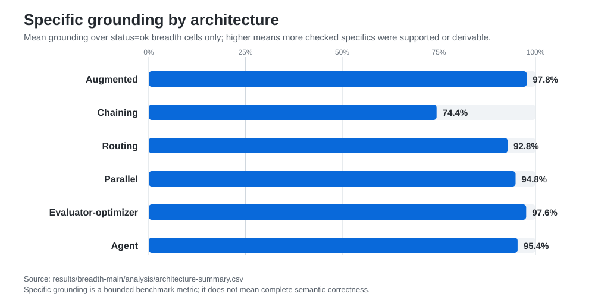
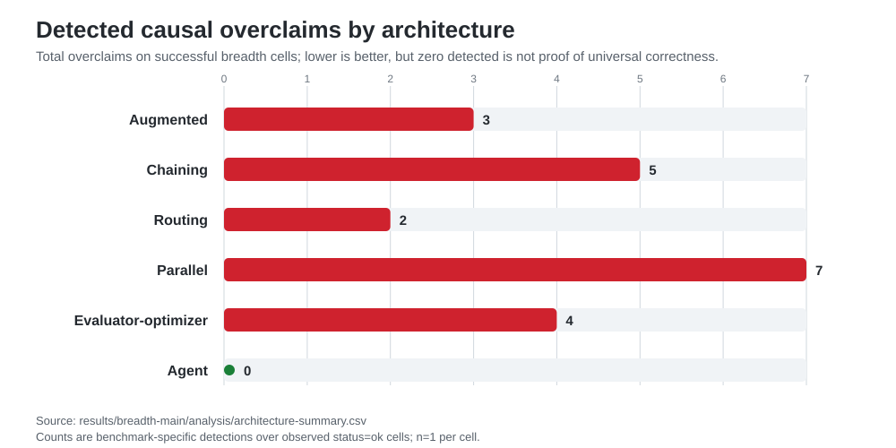
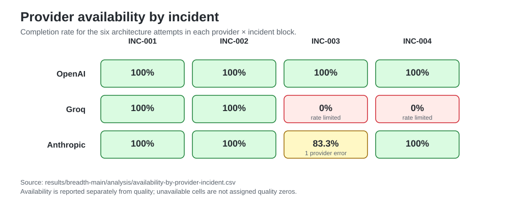

# Evidência visual do Breadth Benchmark

> **Idioma:** Português (Brasil) · [Original em inglês](../BREADTH_VISUAL_EVIDENCE.md)

Esta página fornece uma camada visual compacta sobre o benchmark breadth multi-incidente congelado.

Ela não cria uma nova geração experimental nem recalcula o benchmark. As figuras são visualizações diretas dos artefatos metadata-only já publicados em [`results/breadth-main/`](../../results/breadth-main/).

## Limite experimental

```text
4 incidents × 6 architecture patterns × 1 run × 3 provider bundles
= 72 attempted cells

59 status=ok
12 rate_limited
1 provider_error
```

As figuras de qualidade usam somente células `status=ok`. Falhas de provider/runtime permanecem evidência de disponibilidade e não são convertidas em zeros de qualidade.

O experimento usa `n=1` por célula incidente/padrão/provider, portanto as figuras são descritivas e não estimativas estatísticas.

---

## Specific grounding



Fonte: [`results/breadth-main/analysis/architecture-summary.csv`](../../results/breadth-main/analysis/architecture-summary.csv)

O gráfico visualiza a média de **specific grounding** nas células bem-sucedidas. Specific grounding verifica se os detalhes factuais definidos pelo benchmark são suportados ou deriváveis. Não é uma pontuação completa de correção semântica.

Médias observadas:

| Padrão | Células bem-sucedidas | Grounding médio |
| --- | ---: | ---: |
| Augmented | 10 | 97.8% |
| Chaining | 9 | 74.4% |
| Routing | 10 | 92.8% |
| Parallel | 10 | 94.9% |
| Evaluator-optimizer | 10 | 97.6% |
| Agent | 10 | 95.4% |

---

## Causal overclaims detectados



Fonte: [`results/breadth-main/analysis/architecture-summary.csv`](../../results/breadth-main/analysis/architecture-summary.csv)

Grounding e autoridade causal são dimensões separadas. Uma resposta pode mencionar fatos suportados e ainda assim afirmar mais certeza causal do que o fixture permite.

Totais detectados nas células bem-sucedidas:

| Padrão | Causal overclaims | Taxa de células sem overclaim |
| --- | ---: | ---: |
| Augmented | 3 | 70.0% |
| Chaining | 5 | 66.7% |
| Routing | 2 | 80.0% |
| Parallel | 7 | 60.0% |
| Evaluator-optimizer | 4 | 70.0% |
| Agent | 0 | 100.0% |

O resultado do agente é deliberadamente reportado como **zero causal overclaims detectados nas células observadas**. Isso não prova que agentes sejam universalmente mais seguros, melhores ou causalmente corretos.

---

## Disponibilidade por provider e incidente



Fonte: [`results/breadth-main/analysis/availability-by-provider-incident.csv`](../../results/breadth-main/analysis/availability-by-provider-incident.csv)

Esta visão torna explícita a estrutura dos dados ausentes:

- OpenAI concluiu todas as 24 células tentadas;
- Groq concluiu todas as células de `INC-001` e `INC-002`; depois, os seis padrões sofreram rate limit tanto em `INC-003` quanto em `INC-004`;
- Anthropic concluiu 23 de 24 células, com um provider error em `INC-003 / chaining`.

Portanto, o padrão observado na Groq reflete disponibilidade do provider/tempo/quota naquela geração, e não seis falhas independentes de arquitetura.

---

## O que os visuais sustentam

As figuras facilitam inspecionar três observações separadas:

1. **Grounding não é correção causal.** Grounding alto pode coexistir com causal overclaims.
2. **A arquitetura muda as superfícies de falha.** Topologias sequenciais, paralelas, de routing, evaluator e tool-using expõem comportamentos observáveis diferentes.
3. **Disponibilidade deve ser separada de qualidade.** Células ausentes por falha do provider não podem ser tratadas como outputs com qualidade zero.

A observação mais forte sobre o bounded agent permanece restrita:

> Dentro das células breadth observadas, o bounded tool-using agent foi o único padrão de arquitetura sem causal overclaims detectados, mantendo specific grounding alto.

Esse resultado sustenta investigação adicional de autonomia limitada como mecanismo de aquisição de evidência e contenção causal. Ele não estabelece um vencedor universal de arquitetura.

## Fontes canônicas

- [`MULTI_INCIDENT_BREADTH_BENCHMARK.md`](MULTI_INCIDENT_BREADTH_BENCHMARK.md) — desenho experimental e limite congelado
- [`MULTI_INCIDENT_BREADTH_RESULTS.md`](MULTI_INCIDENT_BREADTH_RESULTS.md) — análise completa e ameaças à validade
- [`results/breadth-main/`](../../results/breadth-main/) — evidence pack metadata-only e checksums SHA-256
- [`architecture-summary.csv`](../../results/breadth-main/analysis/architecture-summary.csv) — métricas derivadas no nível de arquitetura
- [`availability-by-provider-incident.csv`](../../results/breadth-main/analysis/availability-by-provider-incident.csv) — matriz de disponibilidade provider/incidente
